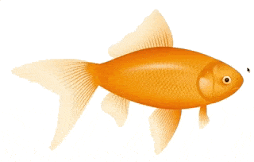

# Image Sketchpad



Draw on any image inside your desktop or mobile browser.

- Get image with sketches as base64 string
  - or download it as PNG
- Get sketches as JSON data
  - With it you can (re)load sketches, without saving a second image
  - No matter at which image size the data was generated
  - For example you can load the same sketches on a bigger version of the image, only ratio has to be the same
  - Load by method or `data-sketchpad-json` attribute
- Set stroke options like line width or color

---

1. [Demo](#demo)
2. [Install](#install)
3. [Usage](#usage)
   1. [Browser: VanillaJS](#browser-vanillajs)
4. [Options](#options)
5. [Methods](#methods)
   1. [setOptions( options )](#setoptions-options-)
   2. [enable()](#enable)
   3. [disable()](#disable)
   4. [toJson()](#tojson)
   5. [loadJson( json )](#loadjson-json-)
   6. [clear()](#clear)
   7. [undo()](#undo)
   8. [redo()](#redo)
   9. [mergeImageWithSketch(originalSize = true)](#mergeimagewithsketchoriginalsize--true)
   10. [download(originalSize = true)](#downloadoriginalsize--true)
   11. [version()](#version)
6. [Documentation](#documentation)
7. [ToDo](#todo)

---

## Demo

You can see a working example online: [DEMO](https://csoellinger.github.io/image-sketchpad/#demo)

## Install

```bash
npm install image-sketchpad --save

# yarn add image-sketchpad
```

## Usage

I have included different files for different usages

### Browser: VanillaJS

First include the JS file at the bottom of your html page

```html
    <script src="image-sketchpad.min.js"></script>
  </body>
</html>
```

Second initialize the sketchpad and bind it to an image

```html
    

    <script src="image-sketchpad.min.js"></script>
    <script>
        var img = document.getElementById('Image');
        var sketchpadOptions = {};
        var sketchPad = ImageSketchpad(img, sketchpadOptions);
    </script>
  </body>
</html>
```

That's it!

## Options

| Name               |            Type             | Default | Description                                                                                                                      |
| ------------------ | :-------------------------: | ------- | -------------------------------------------------------------------------------------------------------------------------------- |
| **lineWidth**      |            _int_            | 5       | Set the sketch line width                                                                                                        |
| **lineMaxWidth**   |            _int_            | -1      | Set the maximum line width, no matter which image ratio we have. -1 = no max width. \_Mostly needed if you draw on zoomed images |
| **lineColor**      |          _string_           | #000    | Line color as hex value                                                                                                          |
| **lineCap**        | _enum(butt\|round\|square)_ | round   | Canvas line cap                                                                                                                  |
| **lineJoin**       | _enum(round\|bevel\|miter)_ | round   | Canvas line join                                                                                                                 |
| **lineMiterLimit** |            _int_            | 10      | Line miter limit                                                                                                                 |

You can set sketchpad options on init or with the [ImageSketchpad.setOptions(options)](#setoptions-options-) method.

## Methods

After initialization you can always get the same instance by calling `ImageSketchpad(el, opts)` again on the same element. With this instance the following methods are available:

---

### setOptions( options )

Set sketchpad options after initialization.

| Param       |     Type      | Default | Description       |
| ----------- | :-----------: | ------- | ----------------- |
| **options** | _UserOptions_ |         | Sketchpad options |

**Return:** _ImageSketchpad_

---

### enable()

Enable sketching

**Return:** _ImageSketchpad_

---

### disable()

Disable sketching

**Return:** _ImageSketchpad_

---

### toJson()

Get sketch as JSON string.

**Return:** _string_

---

### loadJson( json )

Load sketch from JSON string.

| Param    |   Type   | Default | Description                |
| -------- | :------: | ------- | -------------------------- |
| **json** | _string_ |         | Sketch data as json string |

**Return:** _ImageSketchpad_

---

### clear()

Clear the sketchpad.

**Return:** _ImageSketchpad_

---

### undo()

Undo last sketch.

**Return:** _ImageSketchpad_

---

### redo()

Redo undone sketch.

**Return:** _ImageSketchpad_

---

### mergeImageWithSketch(originalSize = true)

Merge the sketchpad canvas with the image and return a promise with a base64 string.

| Param    |   Type   | Default | Description                |
| -------- | :------: | ------- | -------------------------- |
| **originalSize** | _boolean_ | true | If set to false it will merge the image exactly to the size like you see the image in the browser |

**Return:** \_Promise\<string\>\_\_

---

### download(originalSize = true)

Download the image you'll get with [ImageSketchpad.mergeImageWithSketch()](#mergeimagewithsketch) directly.

| Param    |   Type   | Default | Description                |
| -------- | :------: | ------- | -------------------------- |
| **originalSize** | _boolean_ | true | If set to false it will download the image exactly with the size like you see the image in the browser |

**Return:** _ImageSketchpad_

---

### version()

Returns the package version (all libraries, components, modules should have something like this..).

**Return:** _ImageSketchpad_

---

## Documentation

For the very interested: [DOCUMENTATION](https://csoellinger.github.io/image-sketchpad/api/)

## ToDo

- Test with some kind like electron
- Write e2e tests
- Do not force PNG as image output format
- Better documentation/readme
